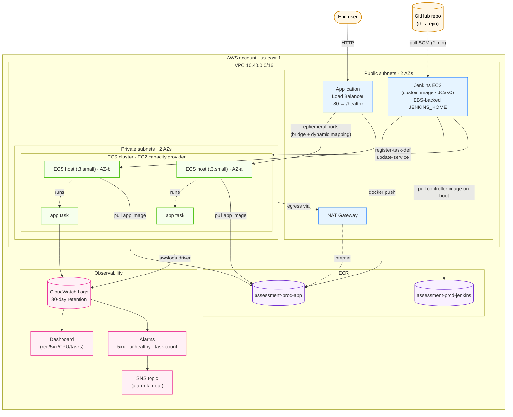

# Assessment — Production-Ready Deployment

A Node.js web service shipped to **ECS on EC2** behind an **ALB**, built and deployed by **Jenkins**, provisioned end-to-end with **Terraform**, observed via **CloudWatch**.

---

## Architecture



### Layers

| Layer | What it is | Files |
| --- | --- | --- |
| **App** | Node 20 / Express, `/`, `/healthz`, `/version`. Multi-stage Dockerfile, runs as non-root, healthcheck baked in. | [`app/`](app/) |
| **Pipeline** | Declarative `Jenkinsfile`: tests in a Node container, `docker build`, push to ECR, register a fresh task definition, `update-service`, wait for `services-stable`. Circuit breaker on the ECS service auto-rolls failed deployments. | [`Jenkinsfile`](Jenkinsfile) |
| **Jenkins controller** | Custom Docker image with plugins + JCasC. The pipeline job is defined as code (`jenkins/casc/jenkins.yaml`); first boot is fully wired — no UI clicks. | [`jenkins/`](jenkins/) |
| **Infra** | Terraform, modular. Bootstrap creates the S3 state bucket. `envs/prod` composes seven modules: `vpc`, `ecr`, `alb`, `ecs-cluster-ec2`, `ecs-service`, `jenkins`, `monitoring`. | [`terraform/`](terraform/) |
| **Observability** | App logs via the `awslogs` driver, Container Insights, dashboard with the 5 panels you'd actually open in an incident, alarms wired to SNS. | [`terraform/modules/monitoring/`](terraform/modules/monitoring/) |

---

## Repo layout

```
.
├── app/                          # Node.js app — what gets containerized
├── Jenkinsfile                   # CI/CD pipeline (declarative)
├── jenkins/                      # Custom Jenkins controller image
│   ├── Dockerfile
│   ├── plugins.txt
│   └── casc/jenkins.yaml         # Configuration-as-Code
├── terraform/
│   ├── bootstrap/                # one-time: S3 state bucket
│   ├── envs/prod/                # composition + tfvars
│   └── modules/
│       ├── vpc/
│       ├── ecr/
│       ├── alb/
│       ├── ecs-cluster-ec2/
│       ├── ecs-service/
│       ├── jenkins/
│       └── monitoring/
└── README.md
```

---

## Prerequisites

- **AWS account** with an admin (or scoped equivalent) credential available to your local CLI (`aws sts get-caller-identity` should work).
- **Terraform** ≥ 1.15.1 (`terraform version`).
- **Docker** running locally (only needed for the one-time Jenkins image push).
- **Node 20+** (only needed if you want to run app tests locally).

---

## Deployment — step by step

> Every step is automated; nothing in the running stack requires UI clicks. The only commands you run locally are bootstrap + the two image pushes + `terraform apply`.

### 1. Bootstrap the state backend (one-time)

```bash
cd terraform/bootstrap
terraform init
terraform apply \
  -var="state_bucket_name=assessment-tfstate-<your-account>-us-east-1"
```

Outputs the bucket name — note it for step 3.

### 2. Build & push the Jenkins controller image (one-time, and on Jenkins config changes)

The Jenkins ECR repo is created by the prod stack, so chicken-and-egg: do a **first apply** without Jenkins (or pre-create the repo manually), push, then apply the rest. Easiest path:

```bash
cd terraform/envs/prod
terraform init \
  -backend-config="bucket=<state-bucket-from-step-1>"
cp terraform.tfvars.example terraform.tfvars   # edit values
terraform apply -target=module.ecr_jenkins
```

Note the `ecr_jenkins_repository_url` output, then:

```bash
cd ../../../jenkins
ACCOUNT=$(aws sts get-caller-identity --query Account --output text)
REGION=us-east-1
REPO=$(aws ecr describe-repositories \
        --repository-names assessment-prod-jenkins \
        --region $REGION --query 'repositories[0].repositoryUri' --output text)

aws ecr get-login-password --region $REGION \
  | docker login --username AWS --password-stdin "$REPO"

# --platform=linux/amd64 is REQUIRED on Apple Silicon. The ECS / Jenkins
# EC2 hosts are x86_64; an arm64-only manifest will fail to pull at runtime.
docker buildx build --platform linux/amd64 -t "${REPO}:latest" --push .
```

### 3. Apply the rest of the infra

Set `jenkins_image` in `terraform.tfvars` to the URI you just pushed (e.g. `…/assessment-prod-jenkins:latest`), then:

```bash
cd terraform/envs/prod
terraform apply
```

Outputs include:
- `alb_url` — the public service URL.
- `jenkins_url` — `http://<jenkins-public-ip>:8080/`.
- `ecr_app_repository_url`, `ecs_cluster_name`, `ecs_service_name`, `ecs_task_family` — already wired into Jenkins via JCasC env vars.

### 4. First deploy of the app

Push the repo to the GitHub URL you set in `repo_url`. Within 2 minutes Jenkins polls SCM, sees the commit, and runs the pipeline.

> **If your fork is private**, add a Jenkins credential first or the clone fails:
>
> 1. GitHub → **Settings → Developer settings → Personal access tokens → Fine-grained** → generate a token scoped to this repo with **Contents: Read-only**.
> 2. In Jenkins UI: **Manage Jenkins → Credentials → System → Global credentials → Add**
>    - Kind: `Username with password`, Username: your GitHub username, Password: the PAT, ID: `github-pat`.
> 3. Open the `assessment-app` job → **Configure → Pipeline → Pipeline script from SCM → Git** → set the credential to `github-pat`. Save.
>
> JCasC re-renders this job on Jenkins restart, so to make the credential reference persist, also reference `github-pat` in the `git { remote { credentials("github-pat") } }` block of `jenkins/casc/jenkins.yaml` and inject the PAT into `casc.env` via Secrets Manager (see "Known limitations").

The pipeline runs:

1. `git checkout`
2. `npm ci && npm test` (in a `node:20-alpine` container)
3. `docker build` — tags `${SHA}-${BUILD_NUMBER}` and `latest`
4. `docker push` to the app ECR repo
5. `aws ecs describe-task-definition` → swap image → `register-task-definition` → `update-service`
6. `aws ecs wait services-stable`

After the first pipeline run, `curl $(terraform output -raw alb_url)/healthz` returns `{"status":"ok"}`.

---

## Operating

- **Logs:** `aws logs tail /ecs/assessment-prod-app --follow` or browse in CloudWatch Logs Insights via the dashboard's "Recent app errors" panel.
- **Dashboard:** CloudWatch → Dashboards → `assessment-prod`.
- **Rollback:** Re-run the pipeline against an older commit (the task-definition history is preserved). Or, in the ECS console, pick a prior task-def revision and update the service.
- **Scaling the app:** change `app_desired_count` in `terraform.tfvars` and re-apply. The ECS service ignores `desired_count` after creation by design; bump via `aws ecs update-service` for hot scaling, or via tfvars + apply for the persistent value.
- **Scaling the cluster:** ECS managed scaling adjusts the ASG to keep `target_capacity = 100`. Bump `ecs_asg_max` if you outgrow it.

---

## Design decisions

- **ECS on EC2, not Fargate.** Per the brief — and EC2 capacity providers with managed scaling are the realistic mid-ground for teams that want predictable costs and the option to right-size compute, without paying the EKS operational tax.
- **Bridge networking + dynamic port mapping.** Classic ECS-on-EC2 pattern. Lets multiple tasks share an instance without ENI math (`awsvpc` on EC2 is throttled by ENI-per-instance limits — `t3.small` would only fit 2 tasks). Easier to reason about for a single-service deployment.
- **Jenkins, not GitHub Actions.** Per preference in the brief. JCasC + a custom controller image keeps it reproducible — no "snowflake Jenkins" anti-pattern. The whole controller is `terraform destroy`-able and `terraform apply`-recreatable.
- **Pipeline registers a fresh task-def on every deploy.** Better than `--force-new-deployment`: you get a clean revision history for rollbacks and the new image tag is captured in ECS, not just in ECR.
- **`ignore_changes = [container_definitions, task_definition, desired_count]`** on the ECS resources. Terraform owns the *shape* of the service; the pipeline owns the *image*. They never fight.
- **Native S3 state locking (`use_lockfile = true`)** instead of DynamoDB. Available since Terraform 1.10 — fewer resources, fewer IAM permissions, no DDB cost.
- **Single NAT gateway.** Saves ~$32/month vs HA NAT. Documented SPOF below; flip `single_nat_gateway = false` to upgrade.
- **App log group lives in the `ecs-service` module**, not `monitoring`. The service owns its logs; monitoring just consumes the name for the dashboard.
- **Deployment circuit breaker enabled**. ECS auto-rolls back a failed deployment without anything in the pipeline.
- **IMDSv2 required on every EC2** (Jenkins + ECS hosts). No metadata-credential exfiltration via SSRF.

---

## Assumptions

- A single environment (`prod`). The module structure makes adding `staging` straightforward (new `envs/staging/` directory, copy and re-tune sizes).
- The repo is hosted on GitHub and reachable from the public internet. Jenkins polls every 2 minutes; for instant deploys, configure a GitHub webhook to `http://<jenkins>/github-webhook/` (Jenkins is already configured to receive them).
- One container per task. The task def memory limit is per-container; if you add sidecars, raise `app_memory`.
- Operator pushes the Jenkins image manually, but only on Jenkins config changes. Day-to-day app deploys never require this.
- No custom domain / TLS in v1. The ALB serves HTTP. Adding HTTPS = one ACM cert + one HTTPS listener; the module already exposes the ALB ARN to wire it.

---

## Known limitations & follow-ups

| Limitation | Why it's like this | How to fix |
| --- | --- | --- |
| **Single NAT gateway** | Cost. | Set `var.single_nat_gateway = false`. |
| **Jenkins is a single EC2** | Sufficient for one-team CI; HA Jenkins is a heavyweight setup. | Run Jenkins controller as an ECS service with EFS-backed `JENKINS_HOME`, or replace with GitHub Actions OIDC for AWS auth. |
| **HTTP-only ALB** | No domain owned. | Provide an ACM cert ARN; add an HTTPS listener + redirect HTTP → HTTPS. |
| **Root AWS credentials in use locally** | Detected from the shell setup, not by design. | Create an IAM user (or SSO role) with least-privilege admin scoped to the project; rotate root keys immediately. |
| **Polling SCM** | Works without inbound webhooks. | Add a GitHub webhook to `http://<jenkins>:8080/github-webhook/` for sub-second triggers. |
| **No image signing / SBOM** | Out of scope for assessment. | Add `cosign` sign-on-push and a `syft` SBOM stage to the pipeline; require signature verification at task-def registration via ECR scan policies. |
| **Logs only in CloudWatch** | Native, cheap, no extra infra. | Add a Kinesis Firehose subscription on the log group → S3/OpenSearch if you need long retention or richer querying. |
| **No autoscaling on the app service** | Two tasks fits the brief. | Add `aws_appautoscaling_target` + `aws_appautoscaling_policy` (target tracking on `ECSServiceAverageCPUUtilization`). |
| **Jenkins admin password is a tfvar** | Simple bootstrap. | Move to AWS Secrets Manager; have JCasC read via the `secrets-manager-credentials-provider` plugin. |

---

## Cost (rough, us-east-1)

| Resource | Monthly |
| --- | --- |
| 2× `t3.small` ECS hosts | ~$30 |
| 1× `t3.medium` Jenkins | ~$30 |
| ALB | ~$18 |
| NAT gateway (single) | ~$32 |
| EBS (root + Jenkins home) | ~$5 |
| CloudWatch logs (low volume) | ~$2 |
| ECR storage | <$1 |
| **Total** | **~$120/mo** |

Tear down with `terraform destroy` from `envs/prod` (then `bootstrap` if you want the state bucket gone too — note: bucket has versioning, so empty it first).

---

## Verifying locally

```bash
# App tests
cd app && npm install && npm test

# Terraform format check
cd ../terraform && terraform fmt -recursive -check

# Per-module validation (requires terraform init in each)
cd modules/vpc && terraform init -backend=false && terraform validate
# …repeat for each module
```
